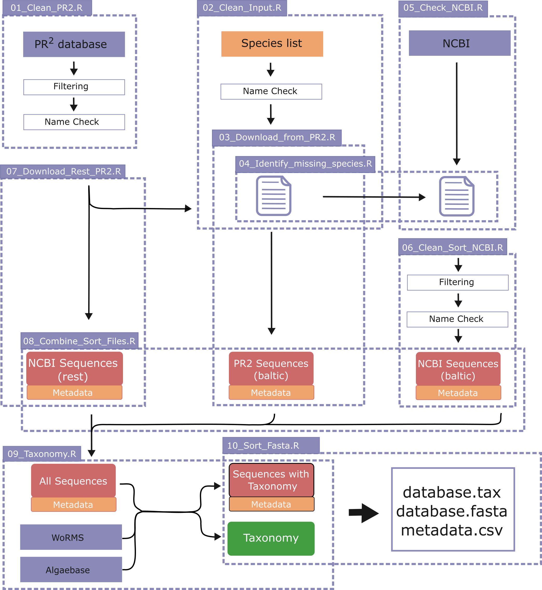

# PR2-wormifier

The manuscript of this pipeline will be soon submitted to Molecular Ecology Resources. For a detailed information please check the manuscript, will be linked as soon as possible.

## Introduction
THe PR2-wormifier builds a customized, curated 18S reference database by combining sequences from PR² and NCBI with validated taxonomy from WoRMS and AlgaeBase. It filters out low-quality or non-nuclear sequences and standardizes species names and metadata. The result is a more comprehensive database that improves taxonomic resolution in metabarcoding studies.

it consists out of 10 scripts, 9 written in R and 1 written in Python



## Overview

[Input](#Input)  
[Dependencies](#Dependencies)   
[Pipeline Scripts](#Pipeline-Scripts)  
[Scripts Associated with Benchmarking](#Scripts-Associated-with-Benchmarking)
[Metadata](#Metadata)  
[References](#References)  

## Input

As Species List the pipeline needs a comma-separated table with the columns: "genus","species","taxon".
The taxon column is important to control if the downloaded and found species really belongs to the same taxonomic group, which is essential to check due to non-unique genus names. The taxonomic group added to the column should fit WoRMS taxonomy. If you prefer to not define the taxonomy, write NA.


As example file check: `Formated_species_list.csv`
This is a species list for the Baltic Sea and was used to create the reference database.

For benchmarking a sedaDNA metabarcoding dataset was used. It is available under the following DOI in FigShare: 

Input Data Overview: 

| File type  | File name | Location |
| ------------- | ------------- | ------------- |
| Species list | Formated_species_list.csv |  00_input_data |
| Cleaned community matrix | Supplementary_Table_5_CommunityMatrix_Cleaned.csv  |  [10.6084/m9.figshare.28457489](https://doi.org/10.6084/m9.figshare.28457489) |
| Uncleaned community counttable | 8_PhytoArk_Euka02_2024_final_community_MUC__mothur_counttable.tsv | [10.6084/m9.figshare.29254598.v1](https://doi.org/10.6084/m9.figshare.29254598.v1)  |
| Amplicon fasta file | 8_PhytoArk_Euka02_2024_final_community_MUC__mothur_sequences.fasta | [10.6084/m9.figshare.28457495](https://doi.org/10.6084/m9.figshare.28457495) |


IMPORTANT:

You need to have access to Algaebase database to run the script, you need an API key which you can request with the help of the following homepage: [Algaebase API link](https://www.algaebase.org/api/)
The key, the email address for NCBI requests and the filename and path of the species list can be saved in ```00_login_data.ini```. Therefore, adaption of the signle R scripts are not neceassary.

## Dependencies

To run the pipeline, you need to have access to Algaebase. For this write a line to:

The pipeline is tested for the following versions: 
Essential R packages: 
```
require(tidyverse)
require(stringi) 

#databases and taxonomy
require(worrms)
require(pr2database)
require(taxonomizr)

#fasta file handling
require(phylotools)
require(seqinr)

# extract from the internet
library(jsonlite)
library(curl)
require(rentrez)

# for plots
require(gapminder)
require(treemapify)
require(ggpubr)
```

###  Versions used

All R scripts were written in R version 4.5.1. The following R packages were used for data wrangling are: dplyr (v1.2.1; (Wickham et al., 2023)), plyr (v.1.8.9; (Wickham, 2011)), tidyr (v1.3.2;  (Wickham et al., 2024)), stringr (v1.6.0; (Wickham, 2025)), stringi (v1.8.7; (Gagolewski, 2022)), purrr (v1.2.2; (Wickham & Henry, 2026)); for sequence handling: pr2database (v5.1.2; (Vaulot, 2026)), seqinr (v4.2.36; (Charif & Lobry, 2007)), phylotools (v0.2.2; (Zhang, 2024)) Biostrings (v2.78.0; (Pagès et al., 2025)); for taxonomy databases:  worrms (v0.4.3; (Chamberlain & Vanhoorne, 2023)), taxonomizr (v0.11.1; (Sherrill-Mix, 2025)); for NCBI access: entrez (v1.2.3; (Winter, 2017)); for API to access Algaebase jsonlite (v2.0.0; (Cooley, 2022)), curl (v6.2.2; (Ooms, 2025)).


The comparison was conducted in R with the following additional R packages: ggplot2 (v4.0.2; (Kassambara, 2023)) tibble (v3.3.1; (Müller & Wickham, 2023)), gapminder (v1.0.1; (Bryan, 2023)), treemapify (v2.6.0; (Wilkins, 2023)), ggpubr (v0.6.1; (Kassambara, 2023)), ghibli (v0.3.4; (Henderson, 2024)), openxlsx (v4.2.8.1; (Schauberger & Walker, 2025)), legendry (v0.2.4; (Brand, 2025b)), ggh4x (v0.3.1; (Brand, 2025a)).

Note: `dplyr`, `tidyr`, `stringr`, `tibble` and `ggplot2` are all part of the R package `tidyverse`

### How to install all packages

Execute the following script

```
Rscript 00_install_Rlib.R
```

Import for the benchmark script the following libraries have to be installed:

```
options(repos = c(CRAN = "https://cloud.r-project.org/"))

#read xlx
install.packages("openxlx")
# data handling ( dependency of tidyverse)
install.packages("tibble")
#the plotting
install.packages(c("gapminder","treemapify","ggpubr", "ghibli", "ggh4x","legendry"))
```

## Pipeline Scripts

Part of all scripts is that the environment is saved, which allow easy repetition of the scripts. The numbers of the output refer always to the script which created them. Next to the folders in which the sequences will be saved, three folders will be created: 1.) workspace 2.) intermediate results (Script 1-8) 3.) final results (9-10).

E.g. `2.9_F_species_FINAL_withAlgaebase.csv` is an output file of the script `02_Clean_Input.R`.

Pipeline Scripts:
- 00_Function_Library.R
- 01_Clean_PR2.R
- 02_Clean_Input.R
- 03_Download_from_PR2.R
- 04_Identify_missing_species.R
- 05_Check_NCBI.py
- 06_Clean_Sort_NCBI_Downloads.R
- 07_Download_Rest_PR2.R
- 08_Combine_Sort_Files.R
- 09_Taxonomy.R
- 10_Sort_Fasta.R

### 00_Function_Library.R

Function: R script containing all functions and also filter options

### 01_Clean_PR2.R

Function: Filters the PR² reference database to retain only nuclear 18S sequences identified to genus or species level, removing organelle-derived and low-resolution entries.

Input:
- 00_login_data.ini

Output:
- 1.12_F_Cleaned_pr2_database_wAlgbase.tsv
- 1.12_F_Cleaned_pr2_database_wAlgbase

### 02_Clean_Input.R

Function: Prepares and formats the user-provided species list to ensure compatibility with the cleaned PR² reference database.

Input:
- 00_login_data.ini
- Formated_species_list.csv
  
Output:
- 2.4_F_species_FINAL.csv # includes only WoRMS results 
- 2.8_F_Algaebase_specieslist.csv  # includes only Algaebase results 
- 2.9_F_species_FINAL_withAlgaebase.csv

### 03_Download_from_PR2.R

Function: Searches the cleaned PR² database for user-specified species and related taxa, downloads matching sequences, and generates a detailed metadata file including taxonomic and sequence information.

Input:
- 1.12_F_Cleaned_pr2_database_wAlgbase.tsv
- 2.9_F_species_FINAL_withAlgaebase.csv

Output:
- 3.1_F_Overview_Species.cs
- PR2_Sequences/Search/SEQUENCES.fasta


### 04_Identify_missing_species.R

Function: Compares the user's species list with downloaded PR² data to identify missing species and prepare input for NCBI searches.

Input:
- 2.9_F_species_FINAL_withAlgaebase.csv
- 3.1_F_Overview_Species.csv

Output:
- 4.1_Missing_Species.csv
- 4.2_Present_Species.csv


### 05_Check_NCBI.R

Function:  Searches NCBI for nuclear 18S sequences of missing or related species, filters results, and downloads relevant sequences. The created folder and metadata will contain the data when the downloading was started.

Input:
- 4.1_Missing_Species.csv
- 4.2_Present_Species.csv
  
Output:
- 4.2_Present_Species_completed_withNCBI.csv
- 02_NCBI_${DATE}/SEQUENCES.fasta
- 02_NCBI_${DATE}_results/


### 06_Clean_Sort_NCBI_Downloads.R

Function: Cleans and filters downloaded NCBI sequences, removing duplicates and non-nuclear 18S entries, and standardizes metadata.

Input:
- 05_Missing_PR2_Downloaded_species_NCBI_info__${DATE}.tsv
- 1.12_F_Cleaned_pr2_database_wAlgbase
- 2.9_F_species_FINAL_withAlgaebase.csv
- 4.1_Missing_Species.csv

Output:
- 6.3_Species_NCBI.csv

### 07_Download_Rest_PR2.R

Function:  Downloads any remaining PR² sequences not yet retrieved, ensuring database completeness.

Input:
- 1.12_F_Cleaned_pr2_database_wAlgbase.tsv
- 3.1_F_Overview_Species.csv
  
Output:
- 7.1_Overview_PR2_Rest.csv
- PR2_Sequences/Rest/SEQUENCES.fasta

### 08_Combine_Sort_Files.R

Function: Merges cleaned NCBI and PR² sequences, assigns metadata, and organizes files to avoid duplication.

Input:
- 3.1_F_Overview_Species.csv
- 6.3_Species_NCBI.csv
- 7.1_Overview_PR2_Rest.csv
- 
Output:
- PR2_Sequences/NCBI/SEQUENCES.fasta
- 8.1_Overview_Sequences_ALL.csv


### 09_Taxonomy.R

Function: Assigns a standardized nine-level WoRMS taxonomy to all sequences, resolving ambiguities and excluding entries without valid taxonomy.

Input:
- 00_login_data.ini
- 1.7_F_Cleanded_pr2_taxonomy.tsv
- 8.1_Overview_Sequences_ALL.csv

Output:
- PR2_metadata_Algaebase.csv
- 9.5_Taxonomy_FINAL.tax
- 9.5_Taxonomy_FINAL2.tax
- 9.6_Overview_Sequences_FINAL.csv


### 10_Sort_Fasta.R

Function: Produces the final fasta file with only taxonomically validated nuclear 18S reference sequences.

Input:
- 9.5_Taxonomy_FINAL2.tax
- 9.6_Overview_Sequences_FINAL.csv

Output:
- 10.1_Sequences_FINAL.fasta
- 10.2_Taxonomy_FINAL_detail.tax
- 10.2_Taxonomy_FINAL.tax
- 10.3__Overview_species_lacking_taxonomy.csv
- 10.4__Overview_species_lacking_taxonomy_detailed.csv

##  Scripts Associated with Benchmarking

These are located in 13_Benchmark_Script and should be executed from the parent directory of `13_Benchmark_Script`, meaning `PATH/TO/FOLDER`, not from within `PATH/TO/FOLDER/13_Benchmark_Script`.

To execute in the following order:

- 00_Functions_Benchmark.R
- 11_Create_Database_Versions.R
- 12_Convert_header_Crabs_part1.R 
- 12_Run_CRABS_DB.sh
- 12_Convert_header_Crabs_part2.R
- 13_combine_mothur.sh
- 13_README_mothur.txt
- 13_Assignment_Stats_Crabs.R
- 13_Assignment_Stats_Crabs_dino.R
- 14_Treemaps_db_results.R
- 14_Treemaps_db_results_dino.R
- 15_DB_Stats.R
- 16_combine_figures.R

  Community files were splitted and concatinated after mothur assignment due to RAM issues.
  The `12_Convert_header_Crabs_part*` script are only neceassary for the fasta files created with `11_Create_Database_Versions.R` due to encoding problems. The `10.1_Sequences_FINAL.fasta` needs no reformatiing to be able to run it with `CRABS`.

For mothur assignments no " are allowed in the count table. 


## Metadata

Explanation for the different taxanomy assignment strategies:
| Taxonomy | |
| ------------- | ------------- |
| 1 | WoRMS, AphiaID in PR2 |
| 2 | WoRMS, without AphiaID in PR2, but a sequence of the same genus has|
| 3 | WoRMS, without AphiaID of any sequence of that genus in PR |
| 4 | WoRMS, without AphiaID and non unique genus name|
| 5 | WoRMS, not 1-4|
| 6 | Algaebase |

## References
- Brand, T. van den. (2025a). ggh4x: Hacks for „ggplot2“. https://doi.org/10.32614/CRAN.package.ggh4x 
- Brand, T. van den. (2025b). legendry: Extended Legends and Axes for „ggplot2“. https://doi.org/10.32614/CRAN.package.legendry 
- Bryan, J. (2023). gapminder: Data from Gapminder. https://CRAN.R-project.org/package=gapminder 
- Chamberlain, S., & Vanhoorne, B. (2023). worrms: World Register of Marine Species (WoRMS) Client. https://doi.org/10.32614/CRAN.package.worrms 
- Charif, D., & Lobry, J. R. (2007). SeqinR 1.0-2: A contributed package to the R project for statistical computing devoted to biological sequences retrieval and analysis. In U. Bastolla, M. Porto, H. E. Roman, & M. Vendruscolo (Hrsg.), Structural approaches to sequence evolution: Molecules, networks, populations (S. 207–232). Springer Verlag. 
- Cooley, D. (2022). jsonify: Convert Between „R“ Objects and Javascript Object Notation (JSON). https://CRAN.R-project.org/package=jsonify 
- Gagolewski, M. (2022). stringi: Fast and portable character string processing in R. Journal of Statistical Software, 103(2), 1–59. https://doi.org/10.18637/jss.v103.i02 
- Henderson, E. (2024). ghibli: Studio Ghibli Colour Palettes. https://CRAN.R-project.org/package=ghibli 
- Kassambara, A. (2023). ggpubr: „ggplot2“ Based Publication Ready Plots. https://CRAN.R-project.org/package=ggpubr 
- Müller, K., & Wickham, H. (2023). tibble: Simple Data Frames. https://CRAN.R-project.org/package=tibble 
- Ooms, J. (2025). curl: A Modern and Flexible Web Client for R. https://doi.org/10.32614/CRAN.package.curl 
- Pagès, H., Aboyoun, P., Gentleman, R., & DebRoy, S. (2025). Biostrings: Efficient manipulation of biological strings. https://doi.org/10.18129/B9.bioc.Biostrings 
- Schauberger, P., & Walker, A. (2025). openxlsx: Read, Write and Edit xlsx Files. https://doi.org/10.32614/CRAN.package.openxlsx 
- Sherrill-Mix, S. (2025). taxonomizr: Functions to Work with NCBI Accessions and Taxonomy. https://doi.org/10.32614/CRAN.package.taxonomizr 
- Vaulot, D. (2026). pr2database: PR2 database with shiny web interface. https://github.com/pr2database/pr2database 
- Wickham, H. (2011). The Split-Apply-Combine Strategy for Data Analysis. Journal of Statistical Software, 40(1), 1–29. 
- Wickham, H. (2025). stringr: Simple, Consistent Wrappers for Common String Operations. https://doi.org/10.32614/CRAN.package.stringr 
- Wickham, H., François, R., Henry, L., Müller, K., & Vaughan, D. (2023). dplyr: A Grammar of Data Manipulation. https://doi.org/10.32614/CRAN.package.dplyr 
- Wickham, H., & Henry, L. (2026). purrr: Functional Programming Tools. https://doi.org/10.32614/CRAN.package.purrr 
- Wickham, H., Vaughan, D., & Girlich, M. (2024). tidyr: Tidy Messy Data. https://doi.org/10.32614/CRAN.package.tidyr 
- Wilkins, D. (2023). treemapify: Draw Treemaps in „ggplot2“. https://CRAN.R-project.org/package=treemapify 
- Winter, D. J. (2017). rentrez: An R package for the NCBI eUtils API. The R Journal, 9(2), 520–526. 
- Zhang, J. (2024). phylotools: Phylogenetic Tools for Eco-Phylogenetics. https://github.com/helixcn/phylotools 
